# 🏗️ System Architecture Design - College Event Aggregator

## 📋 Executive Summary

The **College Event Aggregator** is a full-stack web application designed to centralize college events, hackathons, coding contests, workshops, and cultural activities. The platform enables students to discover, filter, save, and submit events while providing administrators with tools to manage and approve submissions.

**Technology Stack:**
- **Frontend**: React 18 + Vite + Tailwind CSS
- **Backend**: Node.js + Express.js
- **Database**: Supabase (PostgreSQL)
- **Authentication**: JWT (JSON Web Tokens)
- **State Management**: React Context API

---

## 🎯 System Overview

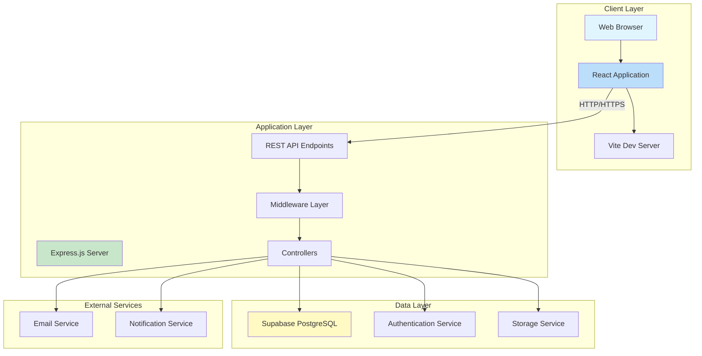

---

## 🏛️ Architecture Layers

### 1. **Presentation Layer** (Frontend)

The client-side application built with React provides an interactive user interface.

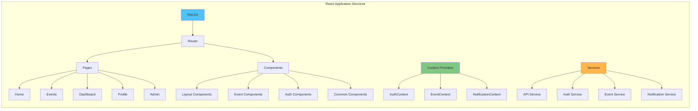

**Key Features:**
- **Responsive Design**: Tailwind CSS for mobile-first responsive layouts
- **Component-Based Architecture**: Reusable React components
- **State Management**: Context API for global state
- **Client-Side Routing**: React Router for SPA navigation
- **API Integration**: Axios for HTTP requests

**Directory Structure:**
```
frontend/src/
├── components/
│   ├── auth/          # Login, Register components
│   ├── common/        # Shared UI components
│   ├── events/        # Event cards, filters
│   └── layout/        # Navbar, Footer, Sidebar
├── pages/             # Route-level components
├── context/           # React Context providers
├── services/          # API service modules
└── utils/             # Helper functions
```

---

### 2. **Application Layer** (Backend)

The server-side application built with Node.js and Express handles business logic and API requests.

```mermaid
graph TB
    subgraph "Express Server Architecture"
        A[server.js] --> B[Middleware Stack]
        
        B --> B1[CORS]
        B --> B2[Body Parser]
        B --> B3[Error Handler]
        B --> B4[Auth Middleware]
        
        C[Routes] --> C1[/api/auth]
        C --> C2[/api/events]
        C --> C3[/api/notifications]
        
        C1 --> D1[authController]
        C2 --> D2[eventController]
        C3 --> D3[notificationController]
        
        D1 --> E[Models]
        D2 --> E
        D3 --> E
        
        E --> E1[User Model]
        E --> E2[Event Model]
        E --> E3[Notification Model]
        
        F[Utils] --> F1[JWT Helper]
        F --> F2[Validators]
        F --> F3[Seeders]
    end
    
    style A fill:#66bb6a
    style B fill:#ffa726
    style C fill:#42a5f5
    style E fill:#ab47bc
```

**Directory Structure:**
```
backend/
├── config/
│   └── db.js              # Supabase connection
├── controllers/
│   ├── authController.js
│   ├── eventController.js
│   └── notificationController.js
├── middleware/
│   ├── auth.js            # JWT verification
│   └── errorHandler.js
├── models/
│   ├── User.js
│   ├── Event.js
│   └── supabase/          # Supabase models
├── routes/
│   ├── authRoutes.js
│   ├── eventRoutes.js
│   └── notificationRoutes.js
├── utils/
│   └── seeder.supabase.js
└── server.js              # Entry point
```

---

### 3. **Data Layer** (Database)

Supabase PostgreSQL provides a robust, cloud-hosted database solution.

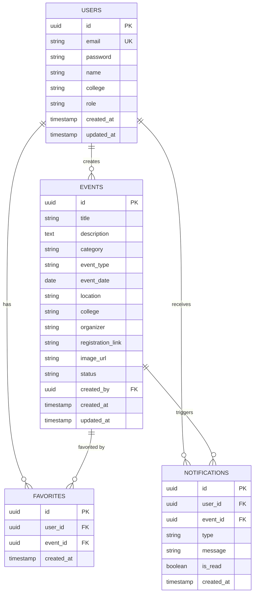

**Database Tables:**

| Table | Purpose | Key Fields |
|-------|---------|------------|
| `users` | User accounts and profiles | id, email, password, role, college |
| `events` | Event listings | id, title, category, event_date, status, created_by |
| `favorites` | User's saved events | user_id, event_id |
| `notifications` | User notifications | user_id, event_id, type, message, is_read |

---

## 🔄 Data Flow Architecture

### Authentication Flow

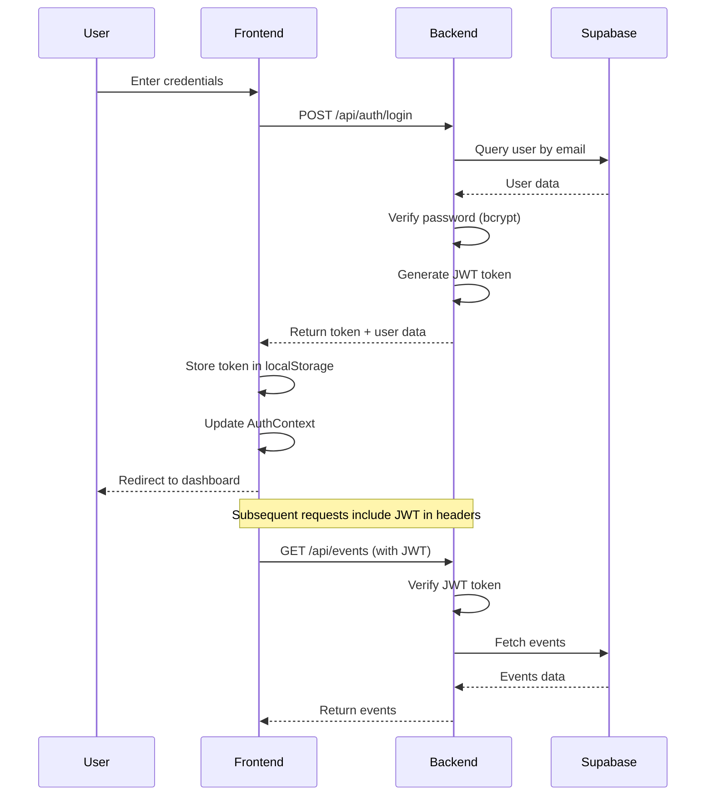

### Event Creation Flow

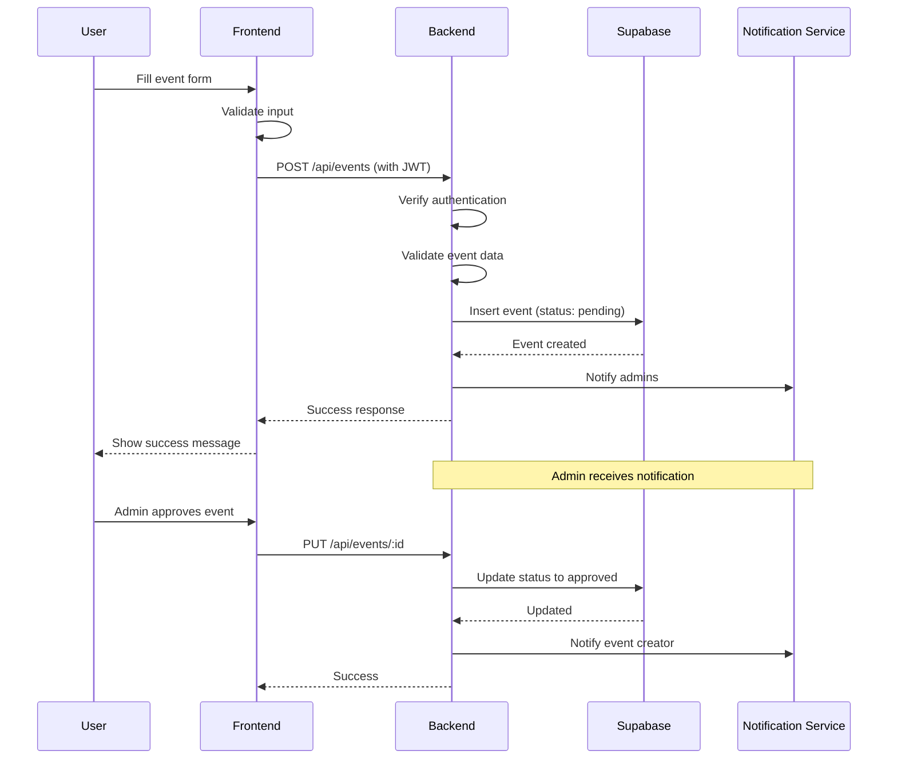

### Event Discovery Flow

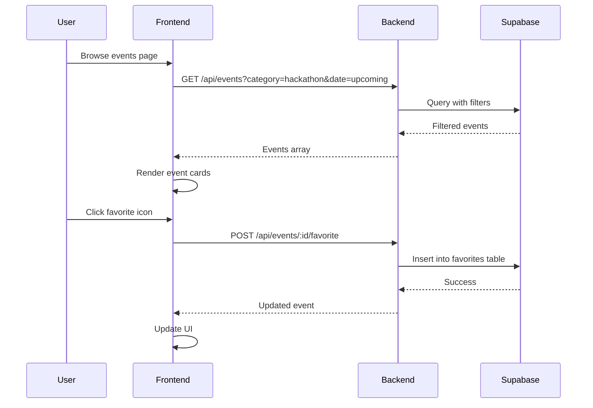

---

## 🔐 Security Architecture

```mermaid
graph TB
    subgraph "Security Layers"
        A[Client Security]
        B[Transport Security]
        C[Application Security]
        D[Database Security]
    end
    
    A --> A1[Input Validation]
    A --> A2[XSS Prevention]
    A --> A3[CSRF Protection]
    
    B --> B1[HTTPS/TLS]
    B --> B2[CORS Policy]
    
    C --> C1[JWT Authentication]
    C --> C2[Password Hashing - bcrypt]
    C --> C3[Role-Based Access Control]
    C --> C4[Rate Limiting]
    C --> C5[Input Sanitization]
    
    D --> D1[Row Level Security]
    D --> D2[Prepared Statements]
    D --> D3[Encrypted Connections]
    
    style A fill:#ef5350
    style B fill:#ffa726
    style C fill:#66bb6a
    style D fill:#42a5f5
```

**Security Measures:**

1. **Authentication & Authorization**
   - JWT tokens with 7-day expiration
   - bcrypt password hashing (10 rounds)
   - Role-based access control (admin, user)
   - Protected routes with auth middleware

2. **Data Protection**
   - Environment variables for sensitive data
   - HTTPS for production
   - Supabase service keys (never exposed to client)
   - SQL injection prevention via parameterized queries

3. **API Security**
   - CORS configuration for allowed origins
   - Request validation with express-validator
   - Error handling without exposing internals
   - Rate limiting (future enhancement)

---

## 🌐 API Architecture

### REST API Endpoints

```mermaid
graph LR
    subgraph "API Routes"
        A[/api] --> B[/auth]
        A --> C[/events]
        A --> D[/notifications]
        
        B --> B1[POST /register]
        B --> B2[POST /login]
        B --> B3[GET /me]
        B --> B4[PUT /profile]
        
        C --> C1[GET /]
        C --> C2[GET /:id]
        C --> C3[POST /]
        C --> C4[PUT /:id]
        C --> C5[DELETE /:id]
        C --> C6[POST /:id/favorite]
        C --> C7[GET /favorites]
        
        D --> D1[GET /]
        D --> D2[PUT /:id/read]
        D --> D3[DELETE /:id]
    end
    
    style B fill:#4fc3f7
    style C fill:#81c784
    style D fill:#ffb74d
```

**API Endpoint Details:**

| Endpoint | Method | Auth | Description |
|----------|--------|------|-------------|
| `/api/auth/register` | POST | ❌ | Register new user |
| `/api/auth/login` | POST | ❌ | Login user |
| `/api/auth/me` | GET | ✅ | Get current user |
| `/api/auth/profile` | PUT | ✅ | Update profile |
| `/api/events` | GET | ❌ | Get all events (with filters) |
| `/api/events/:id` | GET | ❌ | Get single event |
| `/api/events` | POST | ✅ | Create event |
| `/api/events/:id` | PUT | ✅ | Update event (owner/admin) |
| `/api/events/:id` | DELETE | ✅ | Delete event (owner/admin) |
| `/api/events/:id/favorite` | POST | ✅ | Toggle favorite |
| `/api/events/favorites` | GET | ✅ | Get user favorites |
| `/api/notifications` | GET | ✅ | Get user notifications |
| `/api/notifications/:id/read` | PUT | ✅ | Mark as read |
| `/api/notifications/:id` | DELETE | ✅ | Delete notification |

---

## 🚀 Deployment Architecture

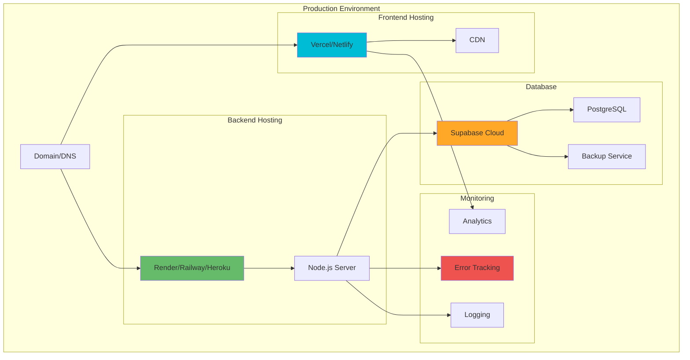

**Deployment Strategy:**

| Component | Platform | Configuration |
|-----------|----------|---------------|
| **Frontend** | Vercel/Netlify | Auto-deploy from Git, CDN, HTTPS |
| **Backend** | Render/Railway | Node.js environment, Auto-scaling |
| **Database** | Supabase | Managed PostgreSQL, Auto-backups |
| **Environment** | Production | NODE_ENV=production, Secure keys |

---

## 📊 System Components

### Frontend Components

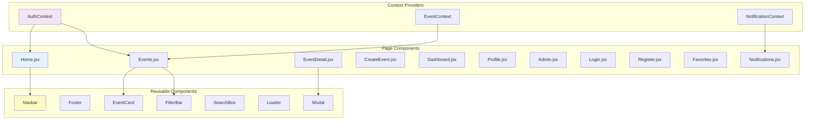

### Backend Controllers

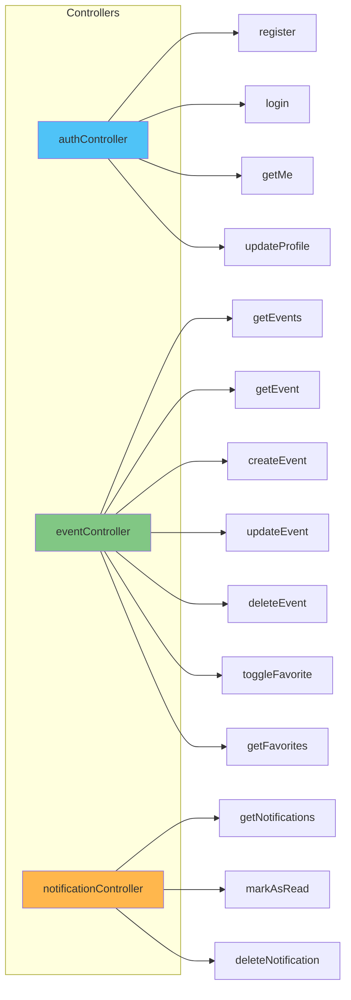

---

## 🔧 Technology Stack Details

### Frontend Technologies

| Technology | Version | Purpose |
|------------|---------|---------|
| React | 18.2.0 | UI library |
| Vite | 7.3.1 | Build tool & dev server |
| React Router | 6.21.0 | Client-side routing |
| Axios | 1.6.2 | HTTP client |
| Tailwind CSS | 3.4.0 | Utility-first CSS |
| Lucide React | 0.294.0 | Icon library |
| Supabase JS | 2.90.1 | Supabase client |

### Backend Technologies

| Technology | Version | Purpose |
|------------|---------|---------|
| Node.js | 18+ | Runtime environment |
| Express | 4.18.2 | Web framework |
| Supabase JS | 2.90.1 | Database client |
| bcryptjs | 2.4.3 | Password hashing |
| jsonwebtoken | 9.0.2 | JWT authentication |
| express-validator | 7.0.1 | Input validation |
| cors | 2.8.5 | CORS middleware |
| dotenv | 16.3.1 | Environment variables |
| multer | 1.4.5 | File upload (future) |

### Database

| Feature | Technology |
|---------|------------|
| Database | PostgreSQL (via Supabase) |
| ORM | Supabase Client SDK |
| Hosting | Supabase Cloud |
| Backup | Automated daily backups |
| Scaling | Auto-scaling |

---

## 🎨 User Roles & Permissions

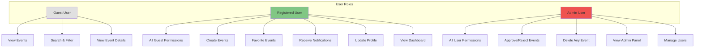

**Permission Matrix:**

| Feature | Guest | User | Admin |
|---------|-------|------|-------|
| View Events | ✅ | ✅ | ✅ |
| Search/Filter | ✅ | ✅ | ✅ |
| Register/Login | ✅ | ✅ | ✅ |
| Create Event | ❌ | ✅ | ✅ |
| Edit Own Event | ❌ | ✅ | ✅ |
| Delete Own Event | ❌ | ✅ | ✅ |
| Favorite Events | ❌ | ✅ | ✅ |
| Notifications | ❌ | ✅ | ✅ |
| Approve Events | ❌ | ❌ | ✅ |
| Delete Any Event | ❌ | ❌ | ✅ |
| Admin Panel | ❌ | ❌ | ✅ |

---

## 🔄 State Management

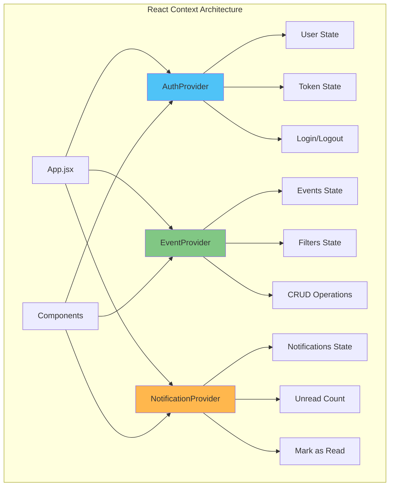

**Context Providers:**

1. **AuthContext**
   - Current user data
   - Authentication token
   - Login/logout functions
   - User role & permissions

2. **EventContext**
   - Events list
   - Active filters
   - CRUD operations
   - Favorites management

3. **NotificationContext**
   - Notifications list
   - Unread count
   - Mark as read/delete
   - Real-time updates (future)

---

## 📈 Scalability Considerations

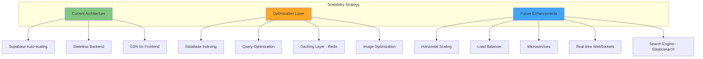

**Performance Optimizations:**

1. **Database Level**
   - Indexed columns (email, event_date, category)
   - Connection pooling
   - Query optimization
   - Pagination for large datasets

2. **Application Level**
   - Lazy loading components
   - Code splitting
   - Debounced search
   - Optimistic UI updates

3. **Infrastructure Level**
   - CDN for static assets
   - Gzip compression
   - HTTP/2 support
   - Auto-scaling on Supabase

---

## 🧪 Testing Strategy

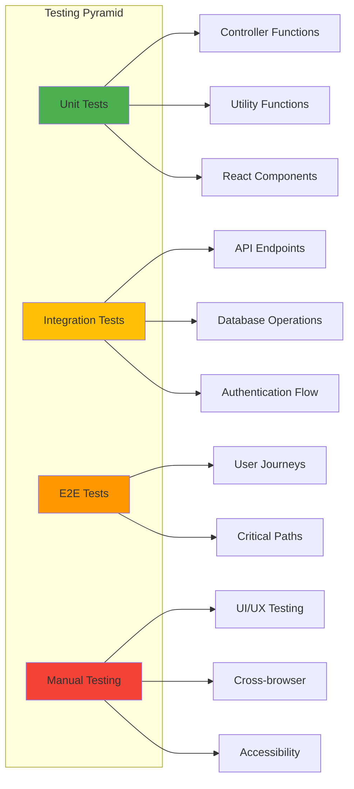

---

## 🔮 Future Enhancements

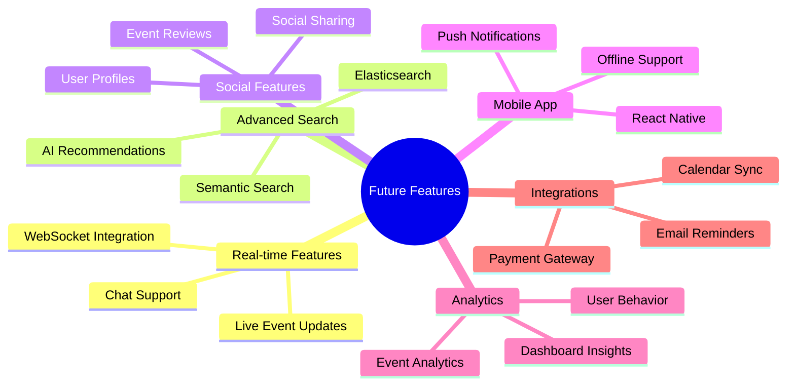

**Planned Features:**

1. **Phase 2**
   - Email notifications
   - Calendar integration
   - Advanced filtering
   - Event reviews & ratings

2. **Phase 3**
   - Real-time updates (WebSockets)
   - Mobile application
   - Social sharing
   - Payment integration

3. **Phase 4**
   - AI-powered recommendations
   - Advanced analytics
   - Multi-language support
   - Accessibility improvements

---

## 📝 Development Workflow

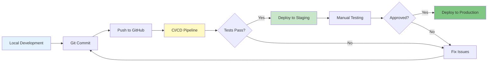

---

## 🎯 Conclusion

The College Event Aggregator is built on a modern, scalable architecture that separates concerns across presentation, application, and data layers. The use of React, Node.js, Express, and Supabase provides a robust foundation for rapid development and future growth.

**Key Architectural Strengths:**
- ✅ **Modular Design**: Clear separation of concerns
- ✅ **Scalable**: Cloud-native with auto-scaling capabilities
- ✅ **Secure**: JWT authentication, bcrypt hashing, RBAC
- ✅ **Maintainable**: Well-organized codebase with clear patterns
- ✅ **Developer-Friendly**: Hot reload, modern tooling, comprehensive docs
- ✅ **Cost-Effective**: Generous free tiers for development

**Technology Decisions Rationale:**
- **React + Vite**: Fast development, modern tooling, excellent DX
- **Express.js**: Lightweight, flexible, extensive ecosystem
- **Supabase**: Managed PostgreSQL, no infrastructure overhead, built-in features
- **JWT**: Stateless authentication, scalable across multiple servers
- **Tailwind CSS**: Rapid UI development, consistent design system

This architecture supports the current requirements while providing flexibility for future enhancements and scaling as the platform grows.
